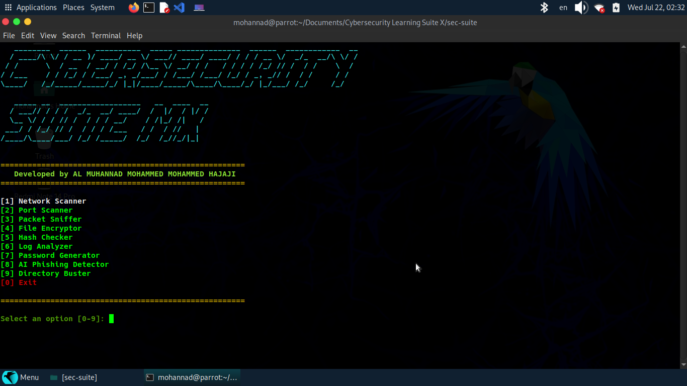

# CYBERSECURITY SUITE

**Developed by: AL MUHANNAD MOHAMMED MOHAMMED HAJAJI**  
**Version:** 1.0.0  
**License:** MIT  

---

## 🛡️ Project Overview

This is a personal, modular Python toolkit I built to apply what I've been learning in cybersecurity — networking, cryptography, and system security — through hands-on code rather than just certifications. Each tool is a small, standalone script I wrote and understand end-to-end, organized into a simple package structure as I learned more about clean code practices.

The suite is engineered to act as both a beautiful Interactive Dashboard via `main.py` and a series of independent Command Line Interface (CLI) scripts suitable for pipeline automation.

---

## Preview 


##  Features & Tools

This platform houses eight highly specialized utility tools:

1. **Network Scanner (ARP):** Rapidly enumerate active hosts on a local subnet using Scapy.
2. **Port Scanner:** Multithreaded TCP port scanner identifying open services dynamically.
3. **Packet Sniffer:** Live network traffic analysis capturing source, destination, and protocol metadata.
4. **File Encryptor:** Secure symmetric encryption (`Fernet`) tool featuring automated backup routines and safety rollbacks.
5. **Hash Checker:** Integrity verification engine validating MD5, SHA1, and SHA256 file checksums.
6. **Log Analyzer:** Auth-log parsing utility designed to extract, aggregate, and flag suspicious or failed SSH login attempts.
7. **Password Generator:** Cryptographically secure token generator enforcing strict character class constraints via Python `secrets`.
8. **AI Phishing Detector:** A strict rule-based heuristic engine analyzing text for social engineering paradigms, credential harvesting triggers, and financial fraud vectors without relying on external ML dependencies.

---

##  Repository Structure

```text
sec-suite/
│
├── .github/workflows/
│   └── ci.yml                  # GitHub Actions CI/CD Pipeline
├── sec_suite/
│   ├── __init__.py
│   ├── utils/
│   │   ├── __init__.py
│   │   └── logger.py           # Centralized ANSI Logger
│   ├── scanners/
│   │   ├── net_scan.py         # ARP Network Scanner
│   │   ├── port_scan.py        # Multi-threaded Port Scanner
│   │   └── packet_sniffer.py   # Scapy Packet Sniffer
│   ├── crypto/
│   │   ├── file_crypt.py       # Fernet Encryptor
│   │   └── hash_checker.py     # Hash Integrity Tool
│   ├── analysis/
│   │   ├── log_analyzer.py     # Auth Log Parser
│   │   └── ai_phishing_detector.py # Heuristic Phishing Engine
│   └── tools/
│       ├── pass_gen.py         # Secure Password Generator
│       └── dir_buster.py       # HTTP Directory Enumerator
│
├── tests/
│   ├── __init__.py
│   └── test_suite.py           # Pytest Suite
│
├── main.py                     # Main ASCII Dashboard
├── requirements.txt            # Project Dependencies
├── .gitignore                  # Professional Gitignore
├── LICENSE                     # MIT License
└── README.md                   # Project Documentation


⚙️ Installation & Setup
Requirements
Python 3.10+
Root/Administrator privileges (required for Network Scanning & Packet Sniffing via Scapy)

Quick Start
Clone the repository and install dependencies:
     
        bash ;
git clone [https://github.com/yourusername/sec-suite.git](https://github.com/yourusername/sec-suite.git)
cd sec-suite
python3 -m venv venv
source venv/bin/activate  # On Windows use: venv\Scripts\activate
pip install -r requirements.txt
        Launch the interactive dashboard:
     bash : 

sudo python3 main.py

      (Note: sudo is highly recommended if you intend to use Scapy packet tools)


💻 Detailed Usage & CLI Examples
Every tool in the suite can be used interactively via main.py, or executed directly from the terminal bypassing the UI for automation tasks.

1. Network Scanner
What it does: Sends ARP broadcasts to discover devices on a local area network.
Why it exists: Crucial for IT administrators performing asset discovery and identifying unauthorized network nodes.
Example CLI: 
sudo python3 sec_suite/scanners/net_scan.py -t 192.168.1.1/24

2. Port Scanner
What it does: Establishes TCP connections across a defined port range to determine open services.
Why it exists: Helps uncover exposed services and reduce the attack surface of a server.
Example CLI: 
python3 sec_suite/scanners/port_scan.py -t scanme.nmap.org -p 1-1000

3. Packet Sniffer
What it does: Intercepts live network packets and prints metadata (IPs, Protocols).
Why it exists: Foundational for network troubleshooting and identifying clear-text data leaks.
Example CLI: 
sudo python3 sec_suite/scanners/packet_sniffer.py -i eth0 -c 50

4. File Encryptor
What it does: Encrypts and decrypts files using AES in CBC mode (Fernet). Automatically creates .bak rollback files.
Why it exists: Protects sensitive at-rest data from unauthorized access.
Example CLI: 
python3 sec_suite/crypto/file_crypt.py -m enc -f secret.txt -k secret.key

5. Hash Checker
What it does: Generates MD5, SHA1, or SHA256 checksums and compares them against expected values.
Why it exists: Validates file integrity, proving files have not been maliciously altered.
Example CLI: 
python3 sec_suite/crypto/hash_checker.py backup.iso -a sha256 -e expected_hash_here

6. Log Analyzer
What it does: Parses Linux auth.log files with Regex to identify IPs aggressively failing authentication.
Why it exists: Essential for recognizing and responding to SSH brute-force attacks.
Example CLI: 
python3 sec_suite/analysis/log_analyzer.py -f /var/log/auth.log

7. Password Generator
What it does: Utilizes OS-level randomness (secrets library) to create highly entropic passwords.
Why it exists: Human-generated passwords are often guessable; cryptographically secure generation prevents dictionary attacks.
Example CLI: 
python3 sec_suite/tools/pass_gen.py -l 24

8. AI Phishing Detector (Heuristics)
What it does: Scans email text against rigorous behavioral dictionaries (urgency, money requests, masked URLs).
Why it exists: Serves as a localized, air-gapped defense against social engineering without broadcasting data to 3rd party AI APIs.
Example CLI: 
python3 sec_suite/analysis/ai_phishing_detector.py -t "Urgent: Reset password now"
         
           Testing & CI/CD
The project leverages pytest for unit testing and flake8 for linting.
To run tests locally:
     
         bash :
pytest tests/
flake8 . --count --max-complexity=10 --max-line-length=120 --statistics

A GitHub Actions workflow (ci.yml) is integrated, guaranteeing that all commits pushed to main maintain build stability, pass linting, and succeed in unit testing.

           Security Notice
This toolkit is designed strictly for authorized educational, administrative, and defensive usage.
Ensure you possess explicit permission before running scanning tools against networks or applications.
The author holds no liability for misuse of the network analysis scripts.

           Future Improvements
Expand Log Analyzer to ingest Windows Event Logs (.evtx).
Introduce GUI integration via PyQt5.
Add UDP port scanning capabilities to the Port Scanner.

           Author
AL MUHANNAD MOHAMMED MOHAMMED HAJAJI
A personal cybersecurity learning project built while preparing
for university applications (high school student,self-taught in Python security tooling)


